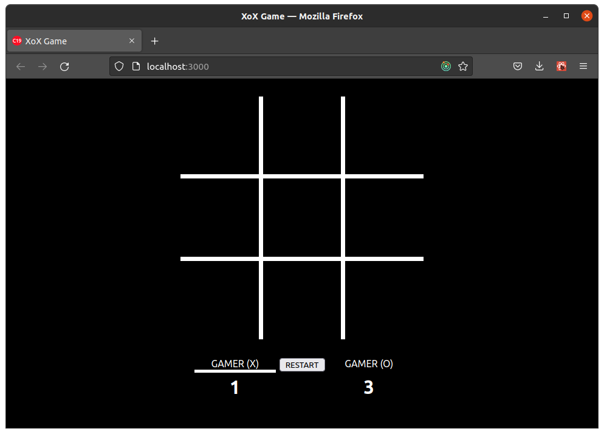

# XoX Game

X ve O oyuncularından oluşan 9 x 9 luk bir alanda, oyanan bir oyun.

## Nasıl Oynanır

Oyunca amaç, oyuncu kendi taşını yan yana, dikey veya çapraz olarak 3 lü olarak sıralayacak.
İlk olarak üçlü sıralamayı oluşturursa oyunu o kazanır.

## Kullanılan Araçlar

Oyun React ve Redux kullanılarak oluşturulmuştur. Sayfa düzenlemeleri CSS ile yapılmıştır.

## Oyun Ekran Görüntüsü

[Test etmek için tıklayın.](https://xoxgame1.netlify.app/ "XoX Game")
